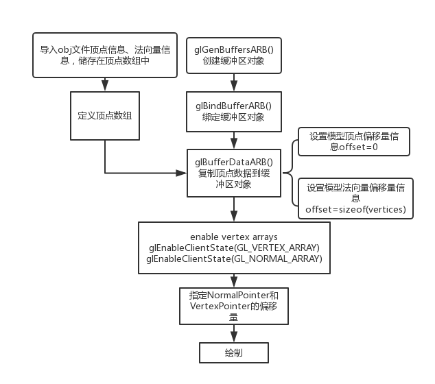

##基于OpenGL的3D台球游戏--BilliardGL

##1 Basic Points

### 1 3D建模

* 基于OpenGL，具有基本体素（立方体、球、圆柱、圆锥、多面棱柱、多面棱台）的建模表达能力
  * **1-15号球、白球**：直径:5.25cm，重量:170g 
  * **球杆**：1.45m
  * **球台**：外框尺寸2810mm·1530mm·840mm，内框尺寸2540mm·1270mm，口袋直径8.5cm
  * **内饰**：包括柜子、沙发等

### 2 obj导入

* 具有基本三维网格导入导出功能（OBJ格式），并将相关操作封装为 ObjLoader 类。
  * **实现方式：**

    首先将obj文件读取到内存中，然后逐行对 obj 文件进行解析。一个典型的 obj 文件结构入下会在每一行的开头标识该行数据的类型，因此根据每一行开头的字母标识将相应信息存储在相应的数据结构中。

    解析 $“v”$（点坐标）、$“v_t”$（纹理）、$“v_n”$（法向量）标识将顶点坐标、法向量、纹理以及面的绘制方式存储Vertex结构中。

    “f” 存储组成每一个面的顶点信息，在 obj 中面由三角形和四边形构成，为了绘制的简化，我们将四边形化为两个三角形存储。

    另一方面读取材质信息，根据 obj 文件中 “mtllib” 后的材质文件名读取 mtl 文件并解析，将相应的材质信息存储在 Material 结构中，解析 “usemtl” 将相应材质索引储存在 mtlIndex容器中。

  * **调用方式：**

    ```C++
    ObjLoader objModel("file.obj");
    ```

### 3 材质与灯光

- **材质** 

  * 具有基本材质、纹理的显示和编辑能力

  - 球体纹理贴图随3D球体一球旋转
  - 环境贴图：观众席、地板、球台、球杆

- **灯光**

  - 基本光照明模型要求，并实现基本的光源编辑（如调整光源的位置，光强等参数）
  - 球台正上方顶灯
  - 球面有反射光
  - 球台以及球体阴影

### 4 场景漫游

* 能对建模后场景进行漫游如Zoom In/Out, Pan, Orbit, Zoom To Fit等观察功能。
* 具有基本几何变换功能（旋转、平移、缩放等）。
* 操作方式：
  * ’w': zoom in
  * 's': zoon out
  * 'a': camera shift left
  * 'd': camera shift right
  * mouse_right_button: orbit view
  * mouse_left_button: hit balls

#2 Awesome Points

### 1 物理碰撞模型

#### (1)基础物理知识
* **摩擦阻力**  

  * 其满足牛顿第二定律:  

  $$
  f = m * a  
  $$

  * 速度与加速度关系公式:  

  $$
  v_t = v_0 + a * t  
  $$

  * 地面摩擦力与运动物体的方向相反, 阻碍物体的向前运动.

* **动量定理**  

  * 假设物体A质量为m1, 速度为v1, 物体B质量为m2, 速度为v2, 碰撞后速度分别为v1', v2'.  

  　　则满足动量守恒定律:  
  $$
  m_1 * v_1 + m_2 * v_2 = m_1 * v_1' + m_2 * v_2'
  $$

* **碰撞类型和能量守恒定律**  
  * 完全弹性碰撞  
    动能没有损失, 则满足如下公式:  
    $$
    \frac{1}{2} * m_1 * v_1^2 +\frac{1}{2}  * m_2 * v_2^2 = \frac{1}{2}  * m_1 * v_1'^2 +\frac{1}{2} * m_2 * v_2'^2 
    $$
    注: 前后物体的动能保持均衡, 没有其他能量的转化.结合之前的动量守恒定律, 我们可以进一步得到: 


#### (2)物理模型
* 台球游戏中, 最核心的就是其物理模型的抽象及其碰撞算法的执行过程，可以简化为2D模型。球运动的方向必然穿越球的中心.把每个台球抽象为圆 $(x, y, radius)$, 而台球桌边框抽象为线段$((x_1, y_1), (x_2, y_2))$.  


* 碰撞检测：类AABB

  * 球与球  
    球 $A(x_1, y_1, r)$ 球 $B(x_2, y_2, r)$. 则满足条件:  
    $$
    (x1 - x2) ^ 2 + (y1 - y2) ^ 2 \leq  (2*r) ^ 2
    $$
    则发生碰撞, 否则没有发生碰撞

  * 球与台边  
    求球心到边框的垂直距离即可

* 碰撞反应
  * 球与球  
    **假定完全弹性碰撞**
    * 不考虑旋转  
        
      **选取两球圆心的直线为x轴, 垂直于圆心直线的为y轴**
      x轴上满足动量守恒:  
      $$
      m_1 * V_x + m_2 * U_x = m_1 * V_x' + m_2 * U_x';
      $$
      并假定两球碰撞是完全弹性碰撞, 两球质量相等 $m_1=m_2$, 依据基础物理知识篇的结论.  

      $$
      V_x' = \frac{[(m_1-m_2) * V_x + 2 * m_2 * Ux]}{(m_1 + m_2)} = U_x;  \\
      Ux' = \frac{[(m_2-m_1) * U_x + 2 * m_1 * V_x]}{(m_1 + m_2)} = V_x;
      $$
      在X轴方向, 两球交换速度, 而在Y轴方向, 两球分速度不变.  
      $$
      V_y' = V_y;  \\
      U_y' = U_y;
      $$
      **最终碰撞后的速度公式为**:  

      $$
      V' = V_x' + V_y' = U_x + V_y;  \\
      U' = U_x' + U_y' = V_x + U_y;
      $$

  * 球与台边
    * 不考虑旋转  
        
      假定碰撞碰撞平面为x轴  

      $$
      V_x' = V_x;  \\
      V_y' = -V_y;
      $$
      最终速度公式为:  

      $$
      V' = V_x' + V_y' = V_x - V_y;
      $$


#### (3)数据结构
```C++
struct Ball {
	struct Point p;
	struct Point v;
	struct Point a;
	GLfloat mv;
	GLfloat ma;
	int isIn;
	GLuint texture;
} Ball[16];
```

### 2 **基于VBO的3D模型绘制**

* 通过接口导入obj文件，我们得到了首先得到了obj模型的顶点信息、法向量信息，如何快速正确的绘制成为我们讨论的问题。通常的OpenGL的绘制方法有以下四种：立即模式、显示模式、顶点模式、VBO模式。首先我们采用立即模式，即使用glBegin和glEnd，仅仅只有3万行的obj模型绘制极慢，绘制成功后转到视角造成非常的严重的顿卡，glVertex函数调用次数太多。
* 我们之后决定采用VBO提升OpenGL的性能，结合了顶点数组和显示列表。Vertex buffer object (VBO) 允许顶点数据储存在高性能显卡上，即服务端的内存中，避免大量数据传输，改善数据传输效率。绘制步骤如下：



* 通过这样的方式，绘制时间大大缩短，画面的流畅度大大提高。

### 3 火焰粒子模型

我们设计在球上生成一个半球与圆锥组合体形状的火焰，已知两点 $A\left (x_1,y_1,z_1\right )$ ，$B\left(x_2,y_2,z_2\right)$ ，生成以AB为直径的半球和以圆AOB为底面的圆锥，则该组合体内任意点的坐标范围为：
$$
\begin{aligned}
x_1-1 &\leq x \leq x_2+1\\
z_1 - 1 -\sqrt{\frac{(x_2-x_1)^2}{4}-(x-\frac{x_1+x_2}{2})^2} &\leq z \leq z_1 + 1 + \sqrt{\frac{(x_2-x_1)^2}{4}-(x-\frac{x_1+x_2}{2})^2}\\
y_1 - \sqrt{(\frac{x_1+x_2}{2}+1)^2-d^2} &\leq y \leq y_1 + 2(\frac{x_2-x_1}{2}+1-d)
\end{aligned}
$$
其中 $d=\sqrt{(x-\frac{x_1+x_2}{2})^2+(z-z_1)^2}$

粒子效果的实现：我们给每个粒子赋一定范围内随机的初始速度、初始加速度和初始位移，然后每次刷新时遵循物理规律：
$$
\overrightarrow{v} = \overrightarrow{v_0}  + \overrightarrow{a}t \\
\overrightarrow{x} = \overrightarrow{x_0}  + \overrightarrow{v}t
$$

### 4 实时阴影

* 投影矩阵的计算：

  * 我们已知平面方程 $Ax + By + Cz + D = 0$ , 光的方向 $L(L_x, L_y, L_z, 0)$. 设模型视图空间的点 $P(P_x, P_y, P_z, 1)$, 沿着光的方向投射到平面上的点为 $S(S_x, S_y, S_z, 1)$. 其中我们设置向量 $N(A, B, C, D)$. 现在我们需要求的是矩阵 $M$, 使得 $MP = S$. 即 $M$ 左乘点 $P$ 得到点 $S$.

  * 由于点 $S$ 是 $P$ 沿着光的方向 $L$ 到达的, 所以可假设 $S = P + kL. (k \geq 0)$

  * 因为点 $S$ 是平面上的一点, 所以 $A*S_x + B*S_y + C*S_z + D = 0$. 即 $S*N = 0$. 由于 $S = P + kL$, 所以 $(P + kL) * N = 0$, 推导可得出 $k = -\frac{(P*N)}{L*N}$.

    即 $K = -\frac{(A*P_x + B*P_y + C*P_z + D)}{(A*L_x + B*L_y + C*L_z)}$, 代入 $S = P + kL$得到

$$
\begin{aligned}
S_x &= P_x + kL_x \\&= \frac{P_x - (AP_x + BP_y + CP_z + D)lX}{(ALx + BLy + C*Lz)}\\

&= \frac{[P_x(BL_y + CL_z) - P_y(BL_x) - Px(CL_x) - 1DL_x]}{(AL_x + BL_y + CL_z)} \\

&= \frac{P((BL_y + CL_z), -BL_x, -CL_x, -DL_x)}{(AL_x + BL_y + C*L_z)}
\end{aligned}
$$
同理 
$$
\begin{aligned}
	Sy &=\frac{P(-AL_y, (AL_x + CL_z), -CL_y, -DL_y)}{(AL_x + BL_y + C*L_z)} \\
	Sz& = \frac{P(-AL_z, -BL_z, (AL_x + BL_y), -DL_x)}{(AL_x + BL_y + C*L_z)} \\
	Sw &= P(0, 0, 0, (AL_x + BL_y + CL_z))/(AL_x + BL_y + C*L_z)
\end{aligned}
$$
所以可得到投影矩阵 $M$: 
$$
M = \left [
\begin{matrix}
BL_y + CL_z    &    -BL_x    &    -CL_x       &          -D*L_x\\

-AL_y        &       AL_x + CL_z&  -CL_y              &  -D*L_y\\

-AL_z        &      -BL_z    &         AL_x + BL_y	& -D*L_x\\

0          &          0           &      0        &             AL_x + BL_y + C*L_z\\
\end{matrix}
\right ]
$$

# 3 依赖

* freeglut 3.0.0
* glm
* glew 1.5.1

